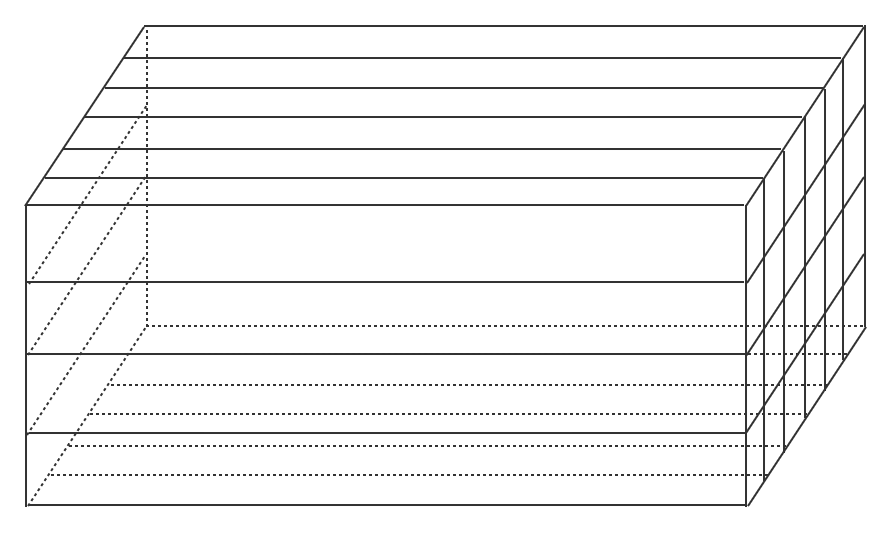

# 上港集装箱堆放优化

## 问题描述：

##### 对货物的处理分为：进，提，装，卸，转五个操作

- 进：即外集卡从码头外运送箱子到堆场箱区，用于货物的出口。货物进堆场的时间一般早于发船时间5天。
- 装：由内集卡将**进**的箱子从堆场运送到岸桥对应桥吊。
- 卸：由内集卡将到港船只的货物从船上卸下，运动到堆场中。
- 提：由外集卡将**卸**下的箱子从堆场运送出码头，一般1-7天内会提走。
- 转：由于要**装**或**提**的箱子，可能在其余箱子的下方，需要将其上方的所有箱子，做一个转箱的操作。

##### 堆场箱区模型

箱区模型大概如图，一个箱区是6排（宽，y轴）4层（高，z轴）x个贝位（x轴）。轮胎吊（轮胎式起重机）的轮胎在x轴上来回移动，轮胎吊的顶部作业滑轮在y轴上移动。

##### 优化目标

1. 提高轮胎吊效率：要想提高轮胎吊效率，应尽量减少轮胎吊在x轴来回移动的距离

##### 待决策变量

1. 箱区容纳率：如果容纳率太高，会导致频繁转箱且没有转箱的位置，一般80%左右比较适合，同时日常转箱的操作可暂不考虑资源的消耗

##### 其余影响因素

##### 初步思路

1. 为了减少轮胎吊在x轴移动的距离，把箱区按左右划分为进和出，比按前后划分为进和出比较好？ 
2. 同时相同作业任务的箱子（指同一批货物）最好堆放在一起，如果在同一个箱区中分散堆放，在外集卡提箱和内集卡装箱时肯定会使轮胎吊来回移动，并且在z轴上，最好要保证这4个箱子是同一批货物，可以尽量避免转箱。
3. 但是如果把同一批货物全部堆放在同一个箱区，会使该箱区的车流量增大，可能会导致内集卡和外集卡车辆在此处聚集，从而空等。所以根据某批货物数量，把同一批货物，平均堆放在不同的箱区内，而在同一个箱区内集中堆放。

##### 其余问题

